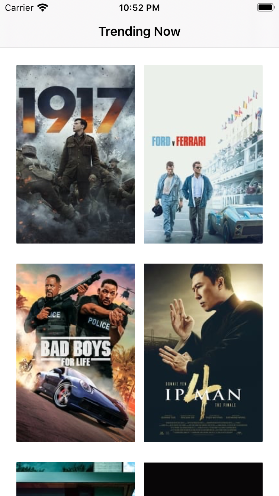
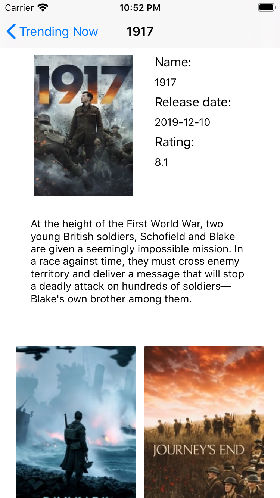
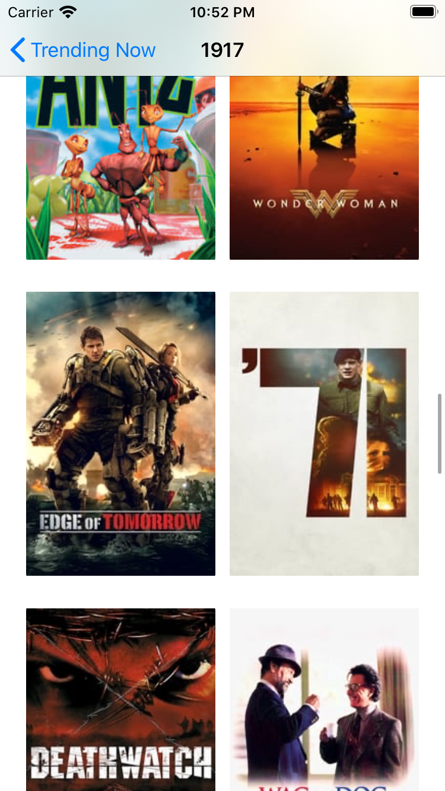
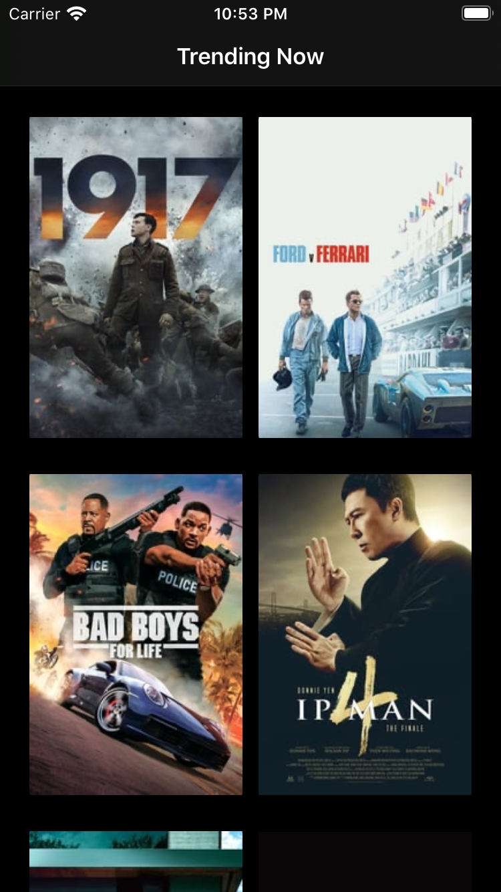

# MoviesDB
iOS App written in Swift 

**Flow:**

   ⎚ Fetch Latest Movie  
   ⎚ On Scroll down, fetches subsequent pages  
   ⎚ On Click, Shows Movie detail along with similer movies(if present)  
   
   
**Dependency:**
   Pod
   
**Lib:**
  Moya
  Alamofie
  Kingfisher
  
    
**includs:**
   XCTest

